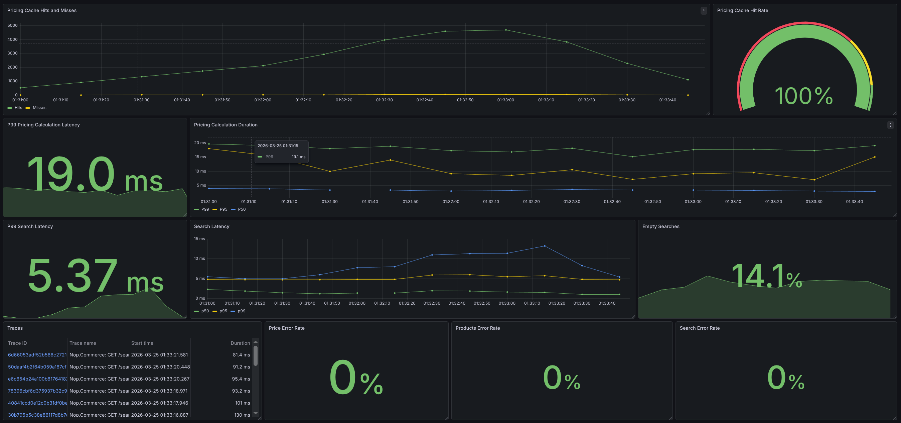
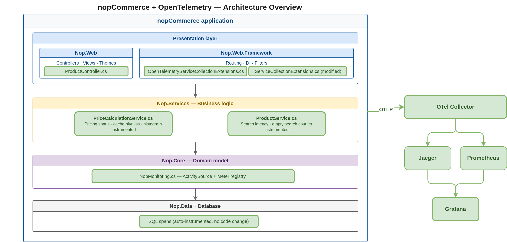

# nopCommerce + OpenTelemetry

Instrumented e-commerce application with distributed tracing and custom metrics for the **"Search and View Product"** user flow.

---

## Quick Start

### 1. Build and Run

```bash
docker compose up
```

### 2. Initialize nopCommerce

Open http://localhost and complete the installation:

**Server name:** nopcommerce_database

**Db name:** nopcommerce

**Username:** sa

**Password:** nopCommerce_db_password

After installation, it might need a restart, so just stop it with a ctrl+c and start again with `docker compose up`.

### 3. View Dashboard

Open **Grafana** at http://localhost:3000 → **Dashboards → NopCommerce Search Flow**

PS: The dashboard JSON is included at the folder `grafana-dashboards/`.

A screenshot of the dashboard is also included:





### 4. Run Load Test

If you don't have k6 installed, follow the instructions here: https://grafana.com/docs/k6/latest/set-up/install-k6/

```bash
k6 run loadtest.js
```

---

## Architecture



**Instrumentation Flow:**
1. **ProductController** → creates `ViewProduct` span
2. **ProductService** → creates `SearchProducts` span + search metrics
3. **PriceCalculationService** → creates `CalculatePrice` span + cache metrics
4. **OTel Collector** → exports to Jaeger (traces) and Prometheus (metrics)
5. **Grafana** → visualizes metrics from Prometheus

---

## Access Points

| Service | URL | Purpose |
|---------|-----|---------|
| **nopCommerce** | http://localhost | Application |
| **Grafana** | http://localhost:3000 | Dashboard |
| **Jaeger** | http://localhost:16686 | Traces |
| **Prometheus** | http://localhost:9090 | Metrics |

---

## Custom Metrics

1. `nop_search_latency` - Search duration histogram
2. `nop_empty_searches` - Empty result counter
3. `nop_price_calculation_duration` - Pricing calculation histogram
4. `nop_pricing_cache_requests` - Cache hit/miss counter
5. `nop_viewproduct_requests` - Product view counter
